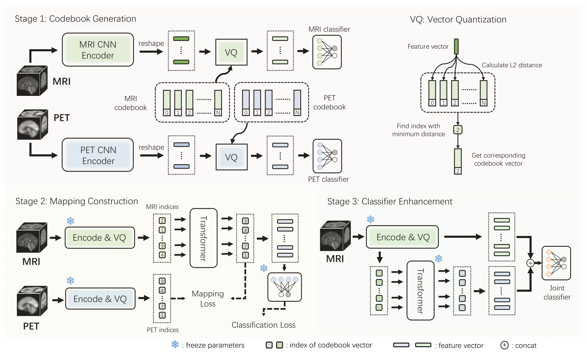

# Vector Quantized Multi-modal Guidance for Alzheimer’s Disease Diagnosis Based on Feature Imputation

This repo contains PyTorch implementation of the paper: Vector Quantized Multi-modal Guidance for Alzheimer’s Disease Diagnosis Based on Feature Imputation

[Paper Link](https://link.springer.com/chapter/10.1007/978-3-031-45673-2_40)

## Setup Instructions

1) Convert your ADNI dataset into a h5py file. Example codes -> "datasets/ADNI2HDF5.py". Note that tabular data is not used in this project, you can ignore the tabular data part in this code.
2) Install dependencies ``pip install -r ./requirements.txt``

## Run the Model

``python train_kfold.py``

Detail options of the training process is in "options.py"